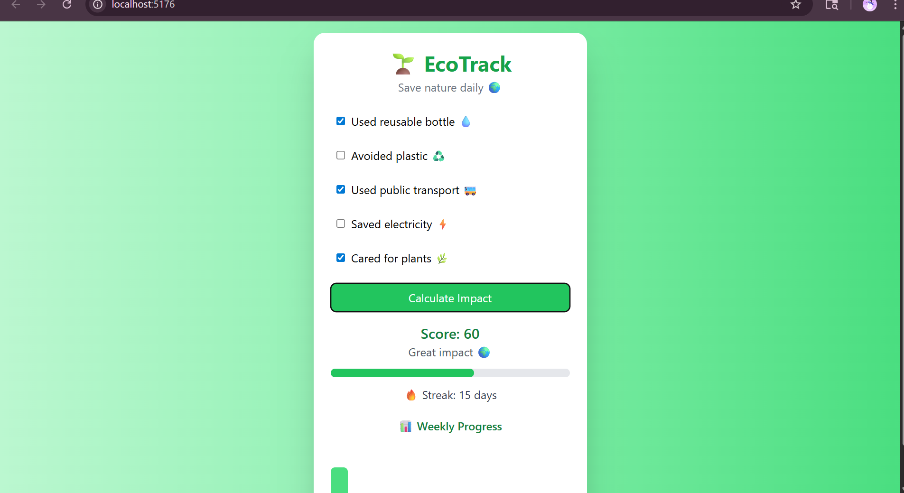

# eco-habit-tracker
🌱 EcoTrack – A React + Tailwind web app to track eco-friendly habits, measure environmental impact, and promote sustainable living with streaks and weekly insights.

# 🌱 EcoTrack – Save Nature Daily 🌍

> 🌿 *A modern eco-friendly habit tracker that helps users build sustainable habits and understand their environmental impact.*

---

## 📸 Screenshot

👉 *(Add your screenshot below)*



---

## 🌍 About the Project

EcoTrack is a **web application** designed to encourage people to adopt eco-friendly habits 🌱 and contribute towards a sustainable future.

Users can track their daily habits, monitor progress, and visualize how small actions can make a **big environmental impact** 💧🌳

---

## ✨ Features

* 🌿 Track daily eco-friendly habits
* 📊 Weekly progress visualization
* 🔥 Streak system to stay consistent
* 🌱 Encourages sustainable lifestyle
* 🎨 Clean & modern UI using Tailwind CSS
* ⚡ Fast and responsive (Vite + React)

---

## 🛠️ Technologies Used

* ⚛️ React
* 🎨 Tailwind CSS
* ⚡ Vite
* 💻 JavaScript (ES6+)
* 🌐 HTML5 & CSS3

---

## 🚀 How to Run the Project

### 🔹 Step 1: Clone the repository

```bash
git clone https://github.com/your-username/eco-habit-tracker.git
```

### 🔹 Step 2: Navigate to project folder

```bash
cd eco-habit-tracker
```

### 🔹 Step 3: Install dependencies

```bash
npm install
```

### 🔹 Step 4: Run the app

```bash
npm run dev
```

### 🔹 Step 5: Open in browser

```
http://localhost:5173
```

---

## 🌐 Where to Run

* 💻 Local machine (VS Code recommended)
* 🌍 Can be deployed on platforms like:

  * Vercel
  * Netlify

---

## 🌱 Impact on People & Environment

EcoTrack is not just a project — it's a **movement towards sustainability** 🌍

### 💡 How it helps people:

* Encourages eco-friendly habits in daily life
* Builds awareness about environmental issues
* Motivates users through streaks and progress

### 🌍 Environmental Impact:

* 💧 Promotes water conservation
* ♻️ Reduces plastic usage awareness
* 🌳 Encourages greener lifestyle
* 🌫️ Helps reduce carbon footprint

👉 *Small habits → Big change* 💚

---

## 📈 Future Improvements

* 🌙 Dark mode
* 📊 Advanced analytics charts
* 🤖 AI-based eco suggestions
* 🔐 User authentication

---

## 🤝 Contributing

Contributions are welcome!
Feel free to fork this repo and improve it 🚀

---

## ⭐ Support

If you like this project:
👉 Give it a ⭐ on GitHub

---

## 👩‍💻 Author

Developed with ❤️ by **Lehashree Srinivasan**

